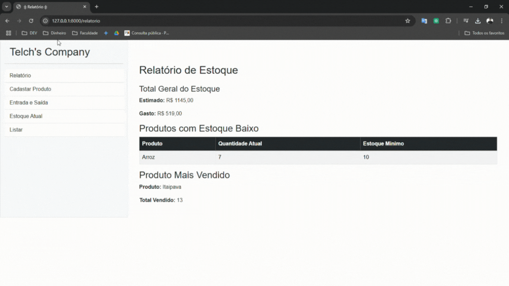

<h1 align="center">CONTROLE DE ESTOQUE</h1>
<p align="center"><i>Simplifique o gerenciamento dos estoque da sua loja com um sistema web</i></p>

# 🔨 To do list

- [x] `SideBar: `Relatório; Cadastrar Produto; Entrada e Saida do Estoque; Estoque atual e Lista de Produtos, Categorias e Fornecedores.
- [x] `CRUD: ` Produtos, fornecedor, categoria.
- [x] `Frontend: ` FontEnzo simples de todo o site.
- [x] `Movimentação: ` Input com opção de entrada e saida
- [x] `Estoque: ` Iteração sobre movimentações para gera sempre o estoque atualizado.
- [x] `Relatório: ` Valor atual do estoque, produtos com baixo estoque, produto mais vendido
- [ ] `Identidade visual: ` Estilizar as páginas

# 📐 Layout



# 🛠️ Baixe e rode o projeto

```bash
# Clone este repositório
$ git clone https://github.com/vitumattos/estoque-django.git

# Acesse a pasta do projeto no seu terminal
$ cd Estoque

# Crie uma venv e acesse-a
> Mac OS
$ python -m venv .venv
$ source .venv/bin/activate

> Windows PowerShell
$ python -m venv .venv
$ .venv/scritps/activate

# Intalação das dependencias
$ pip install requirements.txt

#Execute o aplicativo Local
$ python manage.py migrate
$ python manage.py runserver
```

## ✔️ Técnicas e tecnologias utilizadas

- `Linguagem de programação:` _Python_
- `Framework:` _Django_
- `Estilização:` _Bootstrap_
- `Banco de dados:` _SQLite_

##### 💬 Comentario do Dev (eu)

> _Lembro-me de quando estava mergulhando nos conceitos de lógica de programação, especialmente em programação orientada a objetos. Um dos desafios que enfrentei foi criar um sistema de estoque e armazenar os dados em um arquivo pickle. Naquela época, mal sabia o que isso significava, kkkj. Ao resolver o desafio, pensei: "Por que não desenvolver uma interface para isso?" Foi aí que comecei a me aprofundar em frameworks como django e bancos de dados, e, com o tempo, o projeto começou a ganhar vida._
